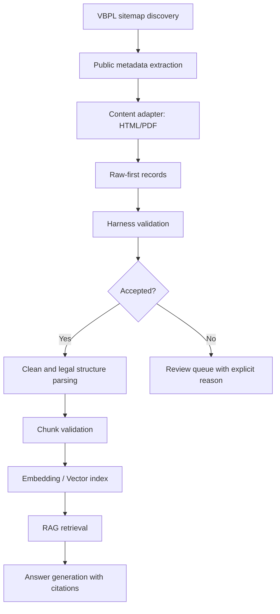
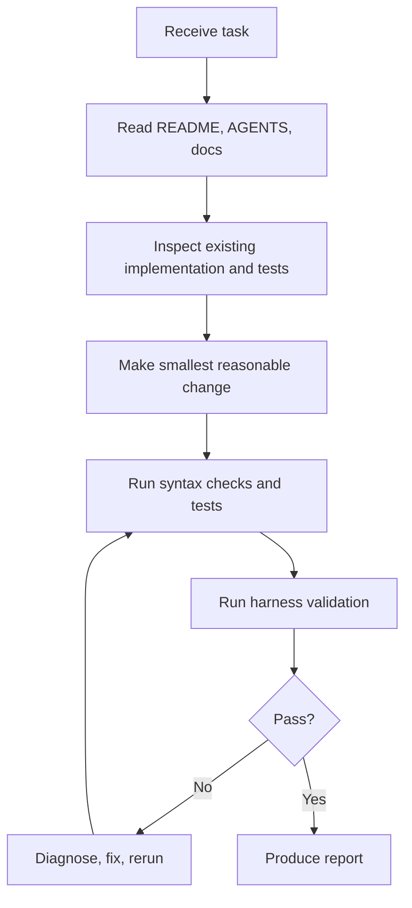

# Kiến trúc VietLawBERT và Harness Engineering v1

## Pipeline dữ liệu

## Feedback loop cho AI agent

Harness v1 không thay crawler đang chạy. Nó bọc pipeline bằng check có thể chạy trong CI: content quality, metadata, duplicate, JSON/JSONL, report JSON nhỏ. Mục tiêu là phát hiện dữ liệu độc hại cho corpus trước khi dữ liệu đi vào cleaning, chunking, embedding, Qdrant/Milvus, hoặc training.

## Nguyên tắc thiết kế

Ưu tiên: correctness, legal-data quality, reproducibility, observability, performance, corpus size. Không tăng corpus size bằng cách nhận record thiếu nội dung, security page, duplicate placeholder, hoặc metadata sai. Các rule có khả năng reject nhầm phải cấu hình được, test được, và ghi rõ giới hạn.
